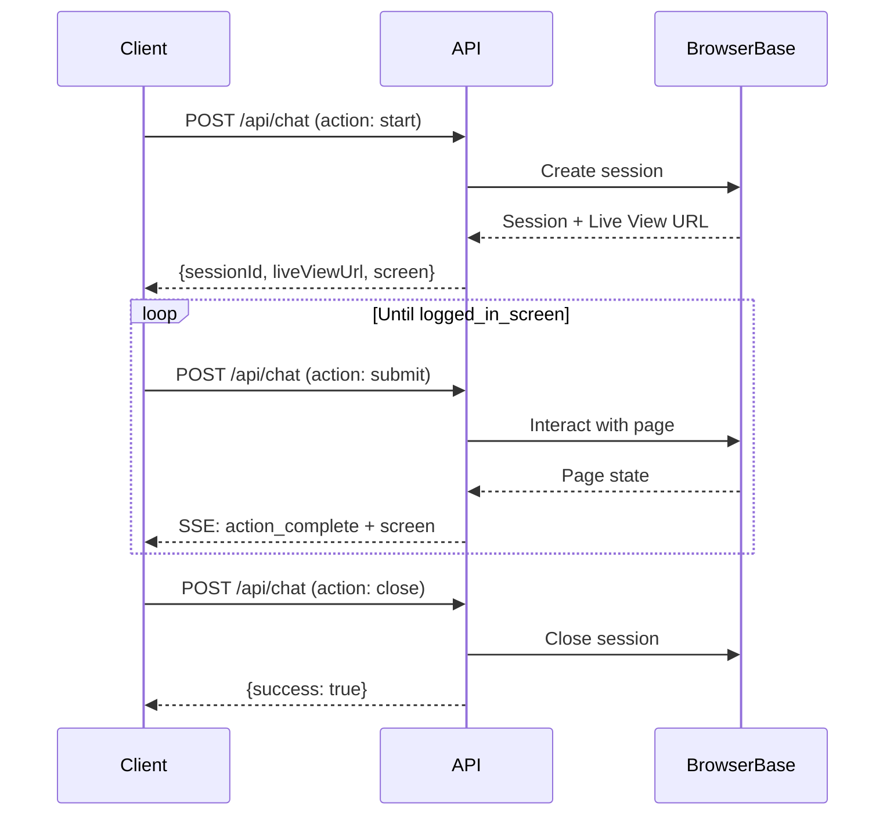

## Architecture

Login Machine exposes a **single endpoint** that handles the entire chat-based login flow:

```
POST /api/chat
```

This endpoint accepts three different **actions** that drive the state machine:

<CardGroup cols={3}>
  <Card title="start" icon="play">
    Create a browser session and navigate to the login page
  </Card>
  <Card title="submit" icon="paper-plane">
    Act on the current screen (fill forms, make choices, handle loading)
  </Card>
  <Card title="close" icon="xmark">
    Tear down the browser session
  </Card>
</CardGroup>

## Base URL

When running locally:

```
http://localhost:3000/api/chat
```

In production, replace with your deployed domain.

## Authentication

The current implementation does not require authentication headers. All actions are identified by the `sessionId` returned from the `start` action.

<Warning>
  In production deployments, you should implement authentication (API keys, JWT tokens, etc.) to prevent unauthorized access.
</Warning>

## Request Format

All requests must:

- Use the `POST` method
- Include `Content-Type: application/json` header
- Provide a JSON body with an `action` field

**Example:**

```bash
curl -X POST http://localhost:3000/api/chat \
  -H "Content-Type: application/json" \
  -d '{"action": "start", "url": "https://example.com/login"}'
```

## Response Types

The endpoint returns different response types depending on the action:

### JSON Responses

Most actions return standard JSON responses:

- `start` action → JSON with session info
- `submit` action (auto-retry scenarios) → JSON with next screen
- `close` action → JSON success confirmation

**Example JSON response:**

```json
{
  "sessionId": "bb_session_abc123",
  "liveViewUrl": "https://browserbase.com/sessions/abc123/view",
  "screen": {
    "type": "loading_screen"
  },
  "screenshot": null
}
```

### Server-Sent Events (SSE)

The `submit` action returns an **SSE stream** when processing user-initiated actions (form submissions, choice selections). This allows real-time updates as the browser processes the action.

**SSE Response Headers:**

```
Content-Type: text/event-stream
Cache-Control: no-cache
Connection: keep-alive
```

**SSE Event Format:**

```
event: action_complete
data: {"action": "Filled login form and clicked submit"}

event: screen
data: {"screen": {...}, "screenshot": "data:image/png;base64,..."}
```

<Note>
  SSE streams are used only for `submit` actions where the user provides input values (credentials, choice selections, etc.). Auto-retry scenarios return plain JSON.
</Note>

## SSE Event Types

### `action_complete`

Emitted first to indicate the browser action has completed.

```json
{
  "action": "Filled login form and clicked submit"
}
```

### `screen`

Emitted after analyzing the new page state.

```json
{
  "screen": {
    "type": "credential_login_form",
    "inputs": [...],
    "submit": {...}
  },
  "screenshot": "data:image/png;base64,..."
}
```

### `error`

Emitted if an error occurs during processing.

```json
{
  "message": "Session not found"
}
```

## Error Handling

### HTTP Status Codes

| Status | Meaning | Example |
|--------|---------|----------|
| 200 | Success | Valid request processed |
| 400 | Bad Request | Invalid JSON, missing required fields, unknown action |
| 500 | Internal Error | Browser crash, network timeout, unexpected exception |

### Error Response Format

JSON errors follow this structure:

```json
{
  "error": "Invalid JSON"
}
```

**Common error messages:**

- `"Invalid JSON"` - Request body is not valid JSON (400)
- `"Unknown action"` - Action field is not start/submit/close (400)
- Zod validation errors - Missing required fields or invalid data types (400)
- `"Session not found"` - Invalid sessionId provided (500)
- `"Internal server error"` - Unexpected exception (500)

## Request Validation

All requests are validated using [Zod](https://zod.dev/) schemas defined in `/src/app/api/chat/route.ts:28-43`.

**Validation schemas:**

```typescript
const StartBody = z.object({
  action: z.literal("start"),
  url: z.string().url().or(z.string().min(1)),
});

const SubmitBody = z.object({
  action: z.literal("submit"),
  sessionId: z.string().min(1),
  screen: LoginStateSchema,
  values: z.record(z.string(), z.string()).default({}),
});

const CloseBody = z.object({
  action: z.literal("close"),
  sessionId: z.string().min(1),
});
```

If validation fails, the endpoint returns a 400 error with the first validation issue message.

## CORS Support

The endpoint includes CORS headers for SSE responses, allowing cross-origin requests from frontend applications:

```typescript
const origin = request.headers.get("origin") ?? "";
const corsHeaders: Record<string, string> = origin
  ? { "Access-Control-Allow-Origin": origin }
  : {};
```

<Note>
  Currently, CORS is permissive for development. In production, configure specific allowed origins.
</Note>

## Screen Types

The API returns different screen types from `/src/lib/ai-login/types.ts:7-14`:

| Screen Type | Description |
|-------------|-------------|
| `credential_login_form` | Form with username/password inputs |
| `choice_screen` | User must select from multiple options |
| `magic_login_link` | Instructions to check email for magic link |
| `logged_in_screen` | Login flow completed successfully |
| `loading_screen` | Page still loading, retry automatically |
| `blocked_screen` | Modal/popup blocking the page |

Each screen type includes different fields optimized for the frontend to render the appropriate UI.

## Session Lifecycle



## Next Steps

<CardGroup cols={2}>
  <Card title="Chat Endpoint" icon="code" href="/api/chat-endpoint">
    Detailed documentation for all three actions
  </Card>
  <Card title="Screen Types" icon="desktop" href="/concepts/screen-types">
    Learn about different screen types and their schemas
  </Card>
</CardGroup>
