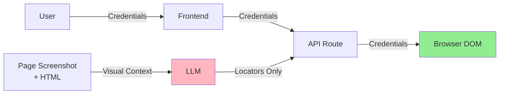

**The LLM never sees user credentials. It only provides locators for where to type them.**

This is a critical security property of Login Machine. The AI agent analyzes the page structure and returns instructions like "there's an email field at `input[name='email']` and a password field at `input[type='password']`", but the actual credential values flow directly from the user to the browser DOM.

From the README:

> **Credential isolation.** The LLM analyzes the page and returns structured data describing what fields exist and their Playwright locators. It never sees what the user types. Credentials flow directly from the user into the browser DOM via Playwright.

## Architecture Overview



<Note>
Credentials (green path) never pass through the LLM (pink path). The LLM only sees the page structure, not the values.
</Note>

## How It Works

### 1. LLM Returns Field Locators

When the agent analyzes a login form, it returns structured data describing the form fields:

From `src/lib/ai-login/agent.ts:93-122`:

```typescript
export async function analyzeLoginPage(
  session: BrowserSession,
): Promise<{ screen: LoginState; screenshot: string }> {
  const { html, screenshot, url } = await getPageContext(session.page);

  const errorHistory: Array<{ error: string }> = [];

  for (let attempt = 0; attempt < MAX_ANALYSIS_RETRIES; attempt++) {
    const errorContext =
      errorHistory.length > 0
        ? `\n\n<error-history>\n${errorHistory.map((e, i) => `Attempt ${i + 1}: ${e.error}`).join("\n")}\n</error-history>`
        : "";

    const { output: object } = await generateText({
      model: anthropic("claude-sonnet-4-5-20250929"),
      output: Output.object({ schema: LoginStateSchema }),
      system: LOGIN_SCREEN_SYSTEM_PROMPT,
      messages: [
        {
          role: "user",
          content: [
            {
              type: "text",
              text: `Current URL: ${url}\n\nHTML:\n${html}${errorContext}`,
            },
            { type: "image", image: `data:image/jpeg;base64,${screenshot}` },
          ],
        },
      ],
    });
```

The LLM receives:
- **URL**: The current page URL
- **HTML**: Stripped HTML with form-relevant tags only
- **Screenshot**: JPEG image of the page

It returns a structured object like:

```json
{
  "type": "credential_login_form",
  "inputs": [
    {
      "type": "email",
      "name": "email",
      "label": "Email address",
      "playwrightLocator": "input[name='email']"
    },
    {
      "type": "password",
      "name": "password",
      "label": "Password",
      "playwrightLocator": "input[type='password']"
    }
  ],
  "submit": {
    "type": "submit",
    "name": "submit",
    "label": "Sign In",
    "playwrightLocator": "button[type='submit']"
  }
}
```

Notice: **no credential values**, only field metadata and locators.

### 2. User Provides Credentials to Frontend

The frontend receives the screen classification and renders a form dynamically based on the fields returned by the LLM. The user types their credentials into this form.

### 3. API Route Receives Credentials + Locators

When the user submits, the frontend sends both the locators (from the LLM) and the values (from the user) to the API route:

From `src/app/api/chat/route.ts:142-147`:

```typescript
if (action === "submit") {
  const parsed = SubmitBody.safeParse(body);
  if (!parsed.success) return err(parsed.error.issues[0].message, 400);

  const { sessionId, screen, values } = parsed.data;
  const session = await getSession(sessionId);
```

The request body contains:
- `screen`: The screen classification from the LLM (includes locators)
- `values`: The credential values from the user (e.g., `{ "email": "user@example.com", "password": "********" }`)

### 4. `fillAndSubmit` Writes Directly to DOM

The API route calls `handleScreen()`, which extracts the relevant locators and calls `fillAndSubmit()`:

From `src/lib/ai-login/agent.ts:209-226`:

```typescript
case "credential_login_form": {
  const hasValues = userInput && Object.values(userInput).some((v) => v);
  if (!hasValues || !screen.inputs || !screen.submit) {
    return {
      nextScreen: null,
      message: { type: "input_request", screen },
    };
  }

  const inputs = screen.inputs
    .filter((input) => userInput[input.name])
    .map((input) => ({
      locator: input.playwrightLocator,
      value: userInput[input.name],
    }));

  await fillAndSubmit(
    session.page,
    inputs,
    screen.submit.playwrightLocator,
  );
```

Notice how `userInput[input.name]` pairs the user-provided value with the LLM-provided locator.

### 5. Browser Automation Layer

The `fillAndSubmit()` function in `src/lib/ai-login/browser.ts` uses Playwright to write values directly to the DOM:

From `src/lib/ai-login/browser.ts:267-294`:

```typescript
/**
 * Fill every field and click submit. Credential values are written directly
 * to the DOM — they never appear in logs or LLM context.
 */
export async function fillAndSubmit(
  page: Page,
  inputs: Array<{ locator: string; value: string }>,
  submitLocator: string,
): Promise<void> {
  for (const { locator, value } of inputs) {
    const filled = await fillInPageOrFrame(page, locator, value);
    if (!filled) {
      console.warn(`[browser] Could not find element for locator: ${locator}`);
    }
  }

  await clickInPageOrFrame(page, submitLocator);

  // Wait for navigation / redirects
  await page.waitForLoadState("load").catch(() => {});
  await page.waitForTimeout(3000);

  try {
    await page.waitForLoadState("domcontentloaded", { timeout: 5000 });
  } catch {
    // Page may already be stable
  }
}
```

The `fillInPageOrFrame()` helper handles the actual DOM manipulation:

From `src/lib/ai-login/browser.ts:307-340`:

```typescript
async function fillInPageOrFrame(
  page: Page,
  locator: string,
  value: string,
): Promise<boolean> {
  try {
    const el = page.locator(locator).first();
    if ((await el.count()) > 0) {
      await el.waitFor({ state: "attached", timeout: 5000 });
      await el.focus();
      await el.clear();
      await el.fill(value);
      return true;
    }
  } catch (e) {
    console.warn(`[browser] Main frame fill failed for ${locator}:`, e);
  }

  for (const frame of page.frames()) {
    if (frame === page.mainFrame()) continue;
    try {
      const el = frame.locator(locator).first();
      if ((await el.count()) > 0) {
        await el.focus();
        await el.clear();
        await el.fill(value);
        return true;
      }
    } catch {
      // Try next frame
    }
  }
  return false;
}
```

<Info>
The function searches both the main frame and all iframes. This is important for enterprise SSO flows that render login forms in cross-origin iframes.
</Info>

## What the LLM Never Sees

The LLM is only involved in step 1 (analyzing the page structure). It never sees:

1. **User input values**: The credentials the user types
2. **Filled form state**: The page after credentials are entered
3. **Submission results**: What happens after the form is submitted

After the form is submitted, the agent waits for the page to load and then takes a **new screenshot** to analyze the next step. By this time, the previous page (with filled credentials) is gone.

From `src/app/api/chat/route.ts:159-173`:

```typescript
if (isUserAction) {
  // SSE: stream action_complete, then analyze and stream screen
  return sseResponse(async (send) => {
    const { message } = await handleScreen(session, screen, values);

    // 1. Signal that the action is done (form fill complete)
    send("action_complete", {
      action: message.type === "action" ? message.action : "Done",
    });

    // 2. Wait for page content to settle, then analyze
    await waitForPageContent(session.page);
    const { screen: analyzed, screenshot } =
      await analyzeLoginPage(session);

    send("screen", { screen: analyzed, screenshot });
  }, corsHeaders);
}
```

The new call to `analyzeLoginPage()` captures the **next** screen (e.g., MFA prompt, dashboard, error message), not the form that was just submitted.

## Logging and Privacy

From the docstring in `src/lib/ai-login/browser.ts:8-9`:

```typescript
// Credentials never pass through this module's logs; values are written
// directly to the DOM.
```

The browser automation layer is designed to ensure credential values don't appear in:
- Server logs
- Error messages
- Debug output

When a fill operation fails, the log shows the **locator** but not the **value**:

```typescript
if (!filled) {
  console.warn(`[browser] Could not find element for locator: ${locator}`);
}
```

## Security Model Summary

<Steps>
  <Step title="Separation of Concerns">
    The LLM analyzes page structure. Playwright handles credential entry. These systems never overlap.
  </Step>
  
  <Step title="Locator Validation">
    Before any credential is written to the DOM, the locators are validated. This prevents credentials from being sent to the wrong fields or leaking via error messages.
  </Step>
  
  <Step title="Stateless Browser Sessions">
    BrowserBase sessions are ephemeral. After login completes, the session is torn down. No credentials persist on the server.
  </Step>
  
  <Step title="No LLM Context Leakage">
    The LLM conversation context only includes page screenshots and HTML structure. User input is never part of the messages array.
  </Step>
</Steps>

<Warning>
While credentials never reach the LLM, they do pass through the API route (`/api/chat`) in plaintext. In production, you should:

1. Use HTTPS/TLS for all traffic
2. Implement request encryption if handling highly sensitive credentials
3. Follow your organization's secrets management policies
4. Consider running Login Machine in a trusted environment (e.g., user's own machine via CLI)
</Warning>

## Why This Matters

By isolating credentials from the AI layer, Login Machine maintains the security properties users expect from traditional password managers:

- **No credential exposure to third parties**: The LLM provider (Anthropic) never sees user passwords
- **No training data contamination**: Credentials can't leak into model training data
- **Auditability**: You can verify in the code exactly where credentials flow

At the same time, you get the flexibility of AI-driven automation that works across any website without per-site customization.

<Tip>
If you're deploying Login Machine in a regulated environment, point security reviewers to the `fillAndSubmit()` function in `browser.ts` and the `analyzeLoginPage()` function in `agent.ts`. The separation between these two systems is the core of the security model.
</Tip>