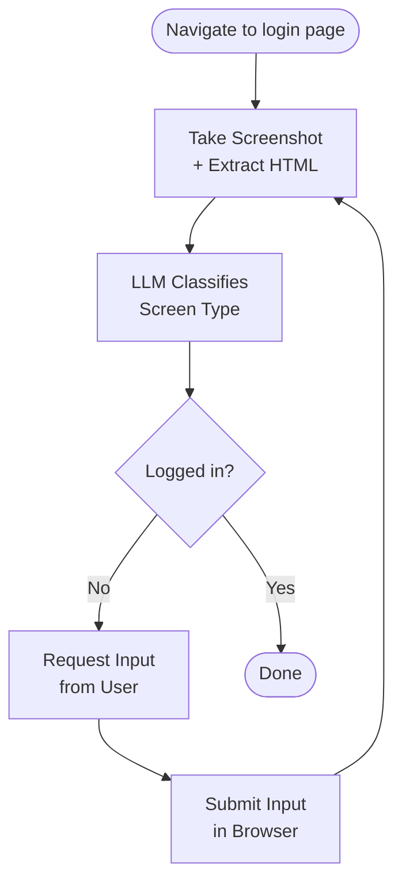

Login Machine uses a single agent loop that can log into any website by continuously observing the page and taking appropriate actions. Unlike traditional automation that relies on hardcoded selectors and brittle state machines, it uses vision-enabled AI to understand what's on screen and decide what to do next.

## The Observation Loop

Every step follows the same pattern: **observe → classify → act → observe again**. The agent never assumes what screen comes next—it always verifies by taking a fresh screenshot and analyzing the page.



## Page Analysis Flow

The core of the system is the `analyzeLoginPage()` function in `src/lib/ai-login/agent.ts`. Here's how it works:

<Steps>
  <Step title="Extract Page Context">
    The browser automation layer captures two pieces of information:
    
    ```typescript
    const { html, screenshot, url } = await getPageContext(session.page);
    ```
    
    - **Stripped HTML**: Raw page HTML is full of scripts, styles, SVGs, and tracking pixels. The extractor walks the DOM recursively and strips everything except form-relevant tags and attributes. It also traverses Shadow DOM boundaries so enterprise SSO widgets aren't missed.
    - **Screenshot**: A JPEG screenshot of the current viewport for visual context.
    
    From `src/lib/ai-login/browser.ts:145-191`:
    
    ```typescript
    const extractBodyHTML = () => {
      function extractHTML(node: Node): string {
        if (node.nodeType === 3) return node.textContent?.trim() || "";
        if (node.nodeType !== 1) return "";

        const el = node as Element;
        const styles = window.getComputedStyle(el);
        if (styles.display === "none" || styles.visibility === "hidden")
          return "";

        const exclude = ["SCRIPT", "STYLE", "svg", "IMG", "NOSCRIPT", "LINK"];
        if (exclude.includes(el.tagName)) return "";

        const root = el.shadowRoot || el;
        let html = `<${el.tagName.toLowerCase()}`;

        for (const attr of el.attributes) {
          if (
            [
              "id",
              "class",
              "type",
              "name",
              "placeholder",
              "role",
              "aria-label",
            ].includes(attr.name)
          ) {
            html += ` ${attr.name}="${attr.value}"`;
          }
        }
        html += ">";

        for (const child of root.childNodes) {
          if (child instanceof HTMLSlotElement) {
            const assigned = child.assignedNodes()[0];
            html += assigned ? extractHTML(assigned) : child.innerHTML;
          } else {
            html += extractHTML(child);
          }
        }

        html += `</${el.tagName.toLowerCase()}>`;
        return html;
      }
      return extractHTML(document.body);
    };
    ```
    
    This cuts token usage by roughly **10x** on complex pages and reduces hallucinated locators.
  </Step>

  <Step title="Send to LLM for Classification">
    The stripped HTML and screenshot are sent to Claude with a system prompt that describes all six screen types. The LLM returns structured output matching a Zod schema.
    
    From `src/lib/ai-login/agent.ts:106-122`:
    
    ```typescript
    const { output: object } = await generateText({
      model: anthropic("claude-sonnet-4-5-20250929"),
      output: Output.object({ schema: LoginStateSchema }),
      system: LOGIN_SCREEN_SYSTEM_PROMPT,
      messages: [
        {
          role: "user",
          content: [
            {
              type: "text",
              text: `Current URL: ${url}\n\nHTML:\n${html}${errorContext}`,
            },
            { type: "image", image: `data:image/jpeg;base64,${screenshot}` },
          ],
        },
      ],
    });
    ```
  </Step>

  <Step title="Validate Locators Against Live DOM">
    Every Playwright locator returned by the LLM is checked against the actual page DOM. If any locator doesn't resolve to an element, the error is fed back to the LLM for retry.
    
    From `src/lib/ai-login/agent.ts:136-156`:
    
    ```typescript
    // Validate every locator against the live DOM
    const locators = getScreenLocators(object);
    if (locators.length === 0) {
      return { screen: object, screenshot };
    }

    const results = await Promise.all(
      locators.map(async (loc) => ({
        locator: loc,
        exists: await validateLocator(session, loc),
      })),
    );

    const missing = results.filter((r) => !r.exists);
    if (missing.length === 0) {
      return { screen: object, screenshot };
    }

    const errorMsg = `Locators not found on page: ${missing.map((m) => m.locator).join(", ")}. Please generate alternative locators.`;
    console.warn(`[agent] Validation failed: ${errorMsg}`);
    errorHistory.push({ error: errorMsg });
    ```
    
    This validation happens **before** any action is taken, preventing hallucinated selectors from causing errors.
  </Step>

  <Step title="Retry with Error Context (Up to 3 Attempts)">
    If validation fails, the system doesn't give up. Instead, it includes the error history in the next LLM call:
    
    From `src/lib/ai-login/agent.ts:101-104`:
    
    ```typescript
    const errorContext =
      errorHistory.length > 0
        ? `\n\n<error-history>\n${errorHistory.map((e, i) => `Attempt ${i + 1}: ${e.error}`).join("\n")}\n</error-history>`
        : "";
    ```
    
    The LLM sees its previous mistakes and can generate alternative locators. This self-correction loop runs up to **3 times**.
  </Step>
</Steps>

<Note>
The validation and retry logic is what makes Login Machine robust. Traditional browser automation scripts break when a selector changes. Here, if the LLM generates a bad locator, the system catches it and asks for a better one—all before touching the page.
</Note>

## Screen Handling Flow

Once a screen is classified, the `handleScreen()` function in `src/lib/ai-login/agent.ts` routes to the appropriate handler:

```typescript
export async function handleScreen(
  session: BrowserSession,
  screen: LoginState,
  userInput?: Record<string, string>,
): Promise<{ nextScreen: LoginState | null; message: AgentMessage }> {
  switch (screen.type) {
    case "credential_login_form":
      // Fill fields + click submit
      await fillAndSubmit(session.page, inputs, screen.submit.playwrightLocator);
      return { nextScreen: null, message: { type: "action", action: "Filled form and submitted" } };
    
    case "choice_screen":
      // Click the selected option
      await clickElement(session.page, option.optionPlaywrightLocator);
      return { nextScreen: null, message: { type: "action", action: `Selected: ${userInput.choice}` } };
    
    case "loading_screen":
      // Wait and re-analyze automatically
      await waitForPageContent(session.page);
      const { screen: nextScreen } = await analyzeLoginPage(session);
      return { nextScreen, message: { type: "thought", content: "Page was loading, waiting..." } };
    
    // ... other screen types
  }
}
```

### User Action Screens vs Auto-Handled Screens

Screens are handled in two different ways:

**User Action Screens** (`credential_login_form`, `choice_screen`, `magic_login_link`):
- Return `nextScreen: null`
- The API route handles re-analysis via SSE streaming
- This allows the frontend to update form status in real-time

**Auto-Handled Screens** (`loading_screen`, `blocked_screen`):
- Re-analyze internally and return the next screen directly
- No user input needed, so no reason to wait

From `src/lib/ai-login/agent.ts:13-15`:
```typescript
// User action screens (credential_login_form, choice_screen, magic_login_link)
// return { nextScreen: null } — the API route handles page re-analysis
// separately via SSE so the frontend can update form status in real time.
```

## API Flow

The entire loop is orchestrated by a single API endpoint at `src/app/api/chat/route.ts`. It handles three actions:

<Accordion title="start — Create browser session and navigate">
  ```typescript
  const session = await createSession();
  
  // Kick off navigation in the background
  session.page
    .goto(parsed.data.url, {
      waitUntil: "domcontentloaded",
      timeout: 30000,
    })
    .catch(() => {});
  
  return ok({
    sessionId: session.sessionId,
    liveViewUrl: session.liveViewUrl,
    screen: { type: "loading_screen" },
    screenshot: null,
  });
  ```
  
  Returns the live view URL immediately so users can see the browser while it navigates.
</Accordion>

<Accordion title="submit — Handle current screen with user input">
  For user action screens (form fill, choice click), the response is an **SSE stream** with two events:
  
  ```typescript
  return sseResponse(async (send) => {
    const { message } = await handleScreen(session, screen, values);
    
    // 1. Signal that the action is done (form fill complete)
    send("action_complete", {
      action: message.type === "action" ? message.action : "Done",
    });
    
    // 2. Wait for page content to settle, then analyze
    await waitForPageContent(session.page);
    const { screen: analyzed, screenshot } = await analyzeLoginPage(session);
    
    send("screen", { screen: analyzed, screenshot });
  }, corsHeaders);
  ```
  
  This allows the frontend to show "Submitting..." → "Analyzing next page..." in real-time.
  
  For auto-retry screens (loading, blocked), it returns plain JSON with the next screen.
</Accordion>

<Accordion title="close — Tear down browser session">
  ```typescript
  await closeSession(parsed.data.sessionId);
  return ok({ success: true });
  ```
  
  Disconnects Playwright from the BrowserBase session.
</Accordion>

## Why This Works

The observation loop solves the fundamental problem with traditional login automation: **login flows are unpredictable**.

- You don't know if the next screen will be another credential form, an MFA prompt, a workspace selector, or a magic link request.
- You can't hardcode the sequence because every website is different.
- Even on the same website, the flow can change based on user settings (2FA enabled, remembered device, etc.).

By treating every screen as self-contained and always re-analyzing after each action, Login Machine handles any flow—no matter how many steps or what order they come in.

<Tip>
The key insight: **login pages are designed for humans**. Every screen is self-contained. You can always figure out what to do just by looking at it. An LLM with vision can do the same.
</Tip>